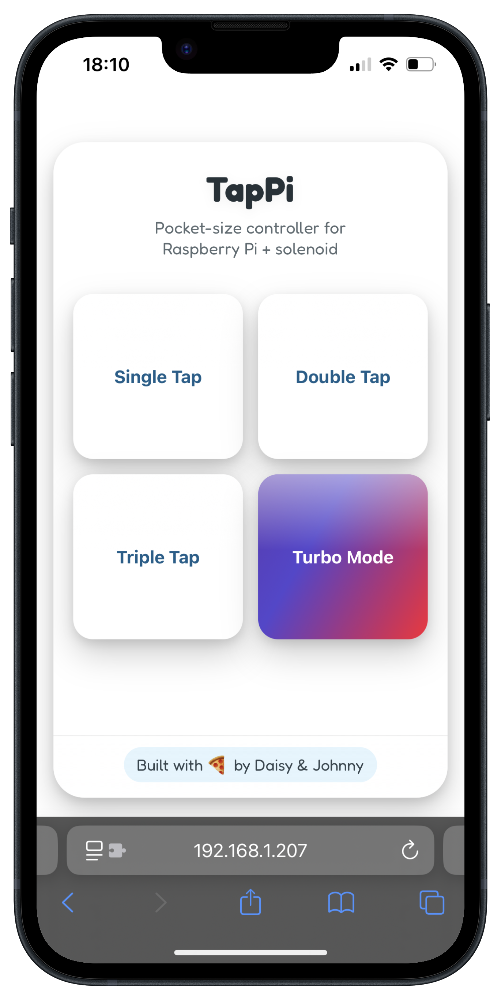

# 🛠️ TapPi 

**TapPi** is a Raspberry Pi–powered web interface that controls a solenoid to perform satisfying mechanical “taps”.


[](https://youtu.be/zqcNg0sHBC4)

### [Click the GIF to **hear it in action** on YouTube 🔊](https://youtu.be/zqcNg0sHBC4)


It was built as a collaborative project with my niece **Daisy** during her work experience week - partly for fun, partly for her to teach me some Python! Together we explored hardware control, threading, and building a playful user interface that turns code into physical action.

## 🚀 Features

- Web-based UI with big, friendly buttons for triggering 1, 2, 3, or 5 solenoid taps
- Responsive design using plain HTML, CSS and JavaScript
- Built with Flask and served on the Pi’s local network
- Uses threading to avoid blocking and allow rapid-fire tap sequences
- Safe GPIO handling with locking and cleanup on shutdown

## 🧰 Tech Stack

- **Backend:** Python 3 + Flask
- **Frontend:** HTML, CSS, Vanilla JS
- **Hardware:** Raspberry Pi GPIO using `RPi.GPIO`
- **Concurrency:** Python `threading.Lock` to protect hardware access

## 🖥️ Interface

The app runs a Flask web server with the following endpoints:

- `/` – renders the interface
- `/solenoid/tap/1` – single tap
- `/solenoid/tap/2` – double tap
- `/solenoid/tap/3` – triple tap
- `/solenoid/tap/5` – go nuts! (multiple rapid taps)

Buttons on the frontend send requests to the server, which triggers the solenoid using the Raspberry Pi's GPIO pins.

## 🔌 Wiring Diagram


## 🛠️ Setup & Usage

> ⚠️ **Note:** You’ll need to run the app with `sudo` to allow access to GPIO pins.

1. **Install dependencies:**

   ```bash
   pip install flask RPi.GPIO

2. **Run the app:**
  
   ```bash
   sudo python app.py

3. **Visit the interface:**

      Open a browser and go to:
   
    ```bash
    http://<your-pi-ip>:5000

4. **Tap away!**
   
      Press one of the buttons to trigger the solenoid in rapid, satisfying bursts.


## 🎥 Demo Video (with sound!)

Click the thumbnail to watch (sound on 🔊).

[](https://youtu.be/zqcNg0sHBC4)




## 🤝 Credits
Made with my niece Daisy as a fun and chaotic work experience project. She taught me some Python, and together we learned how to use it to control real-world hardware - outside of my usual remit as a web developer!
